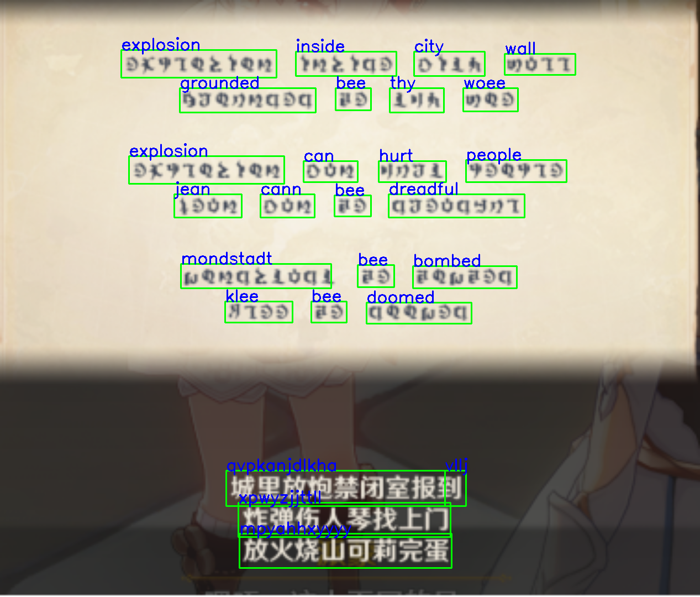

# 简介

本项目基于[EasyOCR](https://github.com/JaidedAI/EasyOCR) 和[ABINet](https://github.com/FangShancheng/ABINet) 实现，EasyOCR提供文本检测和定位框架，ABINet识别文本内容。

数据集基于米游社''采薇东篱夏''制作的[提瓦特字体](https://bbs.mihoyo.com/ys/article/9058992)
使用[TextRecognitionDataGenerator](https://github.com/Belval/TextRecognitionDataGenerator) 自动生成得到。
数据集生成过程中使用[albumentations](https://albumentations.readthedocs.io/) 库进行数据增强，提高模型泛化能力。

